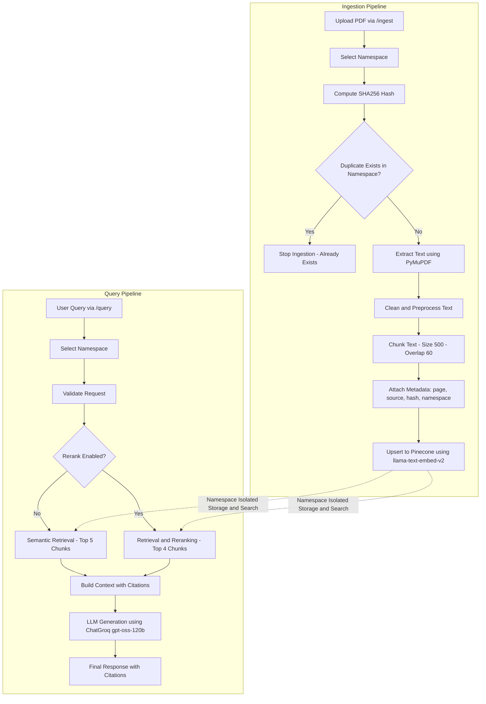

# 🚀 RAG Pipeline with Reranking Masterclass

An enterprise-ready, high-performance Retrieval-Augmented Generation (RAG) pipeline built to extract, embed, retrieve, and generate highly accurate answers from PDF documents. Designed with a focus on speed, accuracy, and scalability, this project leverages the power of **FastAPI**, **Pinecone**, and **Groq** to deliver a seamless query experience augmented by hybrid search and native reranking.

## 🏗️ Architecture



## ✨ Key Highlights

- **Intelligent Document Ingestion**: Robust PDF parsing using `PyMuPDF` with smart, page-aware text chunking.
- **Idempotent Operations**: Prevents redundant vector upserts and saves API costs via SHA-256 duplicate detection.
- **Precision Reranking**: Boosts hit relevance significantly by piping initial vector search results through Pinecone's native reranking models before LLM generation.
- **Blazing Fast Inference**: Integrates with **Groq** API (e.g., `llama-3.1-70b-versatile`) to achieve ultra-low latency generation.
- **Source Citation & Traceability**: The pipeline retains granular metadata (source document name and exact page numbers) throughout the process, enabling the LLM to provide accurate, inline citations for every claim.
- **Production-Ready API**: Cleanly segregated business logic wrapped in a robust, asynchronous **FastAPI** server ready for scalable cloud deployment.

## 🔮 Future Improvements / Work In Progress

- **Asynchronous Ingestion Pipelines**: Shifting document chunking and embedding to background message brokers (like Celery/RabbitMQ) to prevent blocking operations during large file uploads.
- **Advanced Query Routing**: Incorporating an intent-classifier to route queries dynamically to specific indexes or prompt templates for specialized domains.


## 🛠️ Tech Stack

- **Backend Framework:** FastAPI, Python 3.11+
- **Vector Database & Reranker:** Pinecone
- **LLM Engine:** Groq (via Langchain)
- **Document Processing:** PyMuPDF, Hashlib

---

## 🚀 Getting Started

### Prerequisites

- **Python 3.11+**
- **Pinecone Account** with an active API key
- **Groq API Key** (or OpenAI, interchangeable via configuration)

### Installation

1. **Clone the repository**:
   ```bash
   git clone "https://github.com/questinrest/rag-pipeline-reranker"
   cd rag-pipeline-reranker
   ```

2. **Create a virtual environment** (recommended):
   ```bash
   py -3.11 -m venv .venv
   .venv\Scripts\activate   # on Windows
   ```

3. **Install dependencies**:
   ```bash
   pip install -r requirements.txt
   ```

### Environment Configuration

Create a `.env` file in the project root (same directory as `code/`) with the following variables:

```dotenv
PINECONE_API_KEY=<your-pinecone-api-key>
GROQ_API_KEY=<your-groq-api-key>
```
> **NOTE**: The application securely manages configuration variables via Pydantic/`src/config.py`.

### Running the API Server

The core FastAPI application lives in `src/api.py`. To boot up the server locally:

```bash
cd code
uvicorn src.api:app --reload
```

- The server will be securely available at `http://127.0.0.1:8000`.
- Access the **Swagger UI** interactive documentation at `http://127.0.0.1:8000/docs`.

---

## 🔌 API Usage

Interact with the application quickly via the built-in Swagger docs or using cURL/Postman.

### 1. Ingest a Document (`POST /ingest`)
Uploads and processes a PDF into the vector namespace. Safely ignores duplicates.

**Payload**:
```json
{
  "file_path": "C:\\Desktop\\file.pdf"
}
```
*(Note: Ensure backslashes are escaped on Windows, e.g., `"C:\\path\\to\\file.pdf"` or use forward slashes `/`)*

### 2. Query the Knowledge Base (`POST /query`)
Issues a natural language query against the ingested documents. Set `rerank: true` for significantly improved contextual accuracy.

**Payload**:
```json
{
  "query": "What are the rules mentioned for employee onboarding?",
  "rerank": true
}
```

---

## 📁 Project Structure

```text
├─ src/                     # Core business logic
│   ├─ api.py               # FastAPI routing and endpoints
│   ├─ config.py            # Environment configuration & variables
│   ├─ data_models.py       # Pydantic schemas for validation
│   ├─ ingestion.py         # Advanced PDF loading, chunking, deduplication
│   ├─ embedding.py         # Vector embedding and index upserts
│   ├─ retrieval.py         # Base vector similarity search
│   ├─ reranker.py          # Native Pinecone reranking implementation
│   ├─ generation.py        # LLM prompt construction and generation
│   └─ utils.py             # Reusable utilities
├─ docs/                    # Example PDFs and documentation
├─ .env                     # Secrets (User Generated)
├─ requirements.txt         # Core dependencies
└─ README.md                # Project documentation
```
