# Precision RAG with Deduplication

> A production-ready **Retrieval-Augmented Generation (RAG)** pipeline that lets you upload PDF documents and get accurate, cited answers to natural-language questions — with built-in duplicate prevention and optional result reranking.

---

## 🚀 What This Project Does (In Plain English)

Imagine uploading your company's 200-page policy manual and then simply asking *"What is the leave encashment policy?"* — and getting a precise, cited answer back in seconds.

This system makes that possible. It:

1. **Ingests** PDF documents, splits them into smart chunks, and stores them as searchable vectors.
2. **Deduplicates** automatically — the same file uploaded twice is silently skipped, saving cost and time.
3. **Retrieves** the most relevant text chunks for any question using semantic search.
4. **Reranks** those chunks with a second-pass precision model for sharper relevance.
5. **Generates** a clean, cited answer using a large language model.

---

## 🧠 Architecture & Data Flow

```mermaid
graph TD

    subgraph Ingestion Pipeline
        A[Upload PDF via /ingest] --> B[Select Namespace]
        B --> C[Compute SHA-256 Hash]
        C --> D{Duplicate Exists?}
        D -->|Yes| E[Skip — Already Indexed]
        D -->|No| F[Extract Text with PyMuPDF]
        F --> G[Clean & Preprocess Text]
        G --> H[Chunk — 500 tokens, 60-token overlap]
        H --> I[Attach Metadata: page, source, hash, namespace]
        I --> J[Embed & Upsert to Pinecone]
    end

    subgraph Query Pipeline
        K[User Query via /query] --> L[Select Namespace]
        L --> M[Validate Request]
        M --> N{Rerank Enabled?}
        N -->|No| O[Semantic Retrieval — Top 5 Chunks]
        N -->|Yes| P[Retrieve + Rerank — Top 4 Chunks]
        O --> Q[Build Context with Citations]
        P --> Q
        Q --> R[LLM Generation via openai/gpt-oss-120b]
        R --> S[Answer with Inline Citations]
    end

    J -. Namespace-Isolated Storage .- O
    J -. Namespace-Isolated Storage .- P
```



---

## 📈 Impact & Key Achievements

| What Was Built | Why It Matters |
|---|---|
| **SHA-256 deduplication layer** | Prevents redundant vector upserts; cuts embedding API costs on repeat ingestions |
| **Pinecone native reranker** | Boosts precision of top retrieved chunks — fewer irrelevant results reach the LLM |
| **Page-level citation metadata** | Every LLM answer is traceable to an exact page, making the system auditable and trustworthy |
| **Namespace isolation** | Multiple document collections can coexist without cross-contamination |
| **Async-ready FastAPI backend** | Handles concurrent requests and scales horizontally |

---

## 🔧 Problems Faced & How They Were Solved

### 1. Duplicate documents bloating the vector index
**Problem:** Re-uploading the same PDF created redundant vectors, inflating storage costs and degrading retrieval quality.  
**Solution:** Computed a SHA-256 hash of each document at ingest time and stored it as metadata in Pinecone. Before any chunking or embedding, the system checks if the hash already exists in the target namespace and short-circuits if so.

### 2. Semantic search returning loosely related chunks
**Problem:** Vector cosine similarity alone sometimes surfaces chunks that are topically adjacent but not the best answer.  
**Solution:** Integrated Pinecone's native reranking model as a post-retrieval step. Retrieved top-10 candidates are re-scored by a cross-encoder and narrowed to the top 4, dramatically improving answer precision.

### 3. Text and context lost at page boundaries
**Problem:** Naively splitting text at fixed character counts broke sentences and paragraphs across PDF pages, losing context.  
**Solution:** Implemented page-aware chunking with a 60-token overlap window, ensuring that each chunk retains enough adjacent context and that no key sentence is silently dropped at a boundary.

### 4. Unverifiable LLM answers ("hallucinations")
**Problem:** LLMs can generate plausible-sounding but fabricated information with no way to trace the source.  
**Solution:** Every chunk upserted into Pinecone carries structured metadata (`source`, `page`, `namespace`). The retrieval step passes this metadata alongside the text into the LLM prompt, which is instructed to cite its sources. The final response contains inline `[source: filename, page N]` citations.

---

## 💡 What I Learned

- **RAG is only as good as its chunking strategy.** Chunk size and overlap profoundly impact retrieval quality — too small loses context, too large dilutes relevance scores.
- **Reranking is a high-leverage, low-cost upgrade.** Adding a second-pass reranker on top of ANN retrieval consistently beats pure semantic search with minimal added latency.
- **Metadata is a first-class citizen.** Treating citations as a structural requirement — not an afterthought — forces cleaner ingestion design and makes the system genuinely production-trustworthy.
- **Namespace isolation unlocks multi-tenancy.** Designing around namespaces from day one means the system can serve multiple clients or document domains without re-architecting.
- **Cost visibility matters at scale.** Deduplication isn't just an operational nicety — at scale, redundant embeddings become a real API cost line item.

---

## 🔭 Future Improvements

- **Async ingestion queue** — Offload chunking and embedding to Celery/RabbitMQ workers so large multi-document uploads don't block the API thread.
- **Hybrid search (BM25 + dense)** — Combine keyword search with vector search for documents that contain exact codes, IDs, or jargon that semantic search may miss.
- **Intent-based query routing** — A lightweight classifier to route different query types (factual, comparative, summarisation) to specialized prompt templates.
- **Streaming responses** — Use OpenAI's streaming API to begin delivering the answer token-by-token, reducing perceived latency for end-users.
- **Document versioning** — Track when a document is updated so the system can replace stale vectors rather than requiring a manual re-ingest.
- **Evaluation harness** — Integrate `ragas` or a custom eval loop to measure faithfulness, answer relevancy, and context precision automatically on every code change.
- **Multi-modal support** — Extend ingestion to handle tables, diagrams, and scanned PDFs via OCR (e.g., `pytesseract`).

---

## 🛠️ Tech Stack

| Layer | Technology |
|---|---|
| **API Framework** | FastAPI (Python 3.11+) |
| **Vector Database** | Pinecone |
| **Embedding Model** | `llama-text-embed-v2` (via Pinecone) |
| **Reranker** | Pinecone Native Reranker |
| **LLM** | `openai/gpt-oss-120b` |
| **PDF Processing** | PyMuPDF (`fitz`) |
| **Config Management** | Pydantic Settings |
| **Deduplication** | SHA-256 (Python `hashlib`) |

---

## ⚡ Getting Started

### Prerequisites

- Python 3.11+
- [Pinecone account](https://www.pinecone.io/) with an active API key
- OpenAI API key

### Installation

```bash
# 1. Clone the repository
git clone https://github.com/questinrest/rag-pipeline-reranker
cd rag-pipeline-reranker

# 2. Create a virtual environment
py -3.11 -m venv .venv
.venv\Scripts\activate        # Windows
# source .venv/bin/activate   # macOS / Linux

# 3. Install dependencies
pip install -r requirements.txt
```

### Environment Configuration

Create a `.env` file in the project root:

```dotenv
PINECONE_API_KEY=<your-pinecone-api-key>
OPENAI_API_KEY=<your-openai-api-key>
```

> Configuration is validated at startup via Pydantic Settings (`src/config.py`), so missing or malformed keys raise an explicit error rather than a silent runtime failure.

### Run the API Server

```bash
cd code
uvicorn src.api:app --reload
```

- API base URL: `http://127.0.0.1:8000`
- Interactive Swagger docs: `http://127.0.0.1:8000/docs`

---

## 📖 API Reference

### `POST /ingest` — Upload a Document

Parses a PDF, chunks it, embeds it, and stores the vectors in Pinecone. Silently skips files that have already been ingested (deduplication via SHA-256).

```json
{
  "file_path": "C:/path/to/document.pdf"
}
```

**Response:** Confirmation message with the number of chunks upserted, or a notice that the document was already indexed.

---

### `POST /query` — Ask a Question

Runs a semantic search over the indexed documents and returns an LLM-generated answer with source citations.

```json
{
  "query": "What are the rules for employee onboarding?",
  "rerank": true
}
```

**`rerank: true`** activates the precision reranking pass (recommended for most use cases).

**Response:** A natural-language answer with inline page-level citations.

---

## 📂 Project Structure

```text
precision-rag-with-deduplication/
├── code/
│   └── src/
│       ├── api.py           # FastAPI route definitions
│       ├── config.py        # Pydantic settings & env loading
│       ├── data_models.py   # Request/response Pydantic schemas
│       ├── ingestion.py     # PDF extraction, chunking, hashing
│       ├── embedding.py     # Pinecone upsert & embed logic
│       ├── retrieval.py     # Vector similarity search
│       ├── reranker.py      # Post-retrieval reranking pass
│       ├── generation.py    # LLM prompt construction & call
│       └── utils.py         # Shared helper utilities
├── docs/                    # Sample PDFs for testing
├── requirements.txt
├── .env                     # Local secrets (not committed)
└── README.md
```

---

## 📄 License

MIT License — feel free to fork, extend, and build on top of this system.
